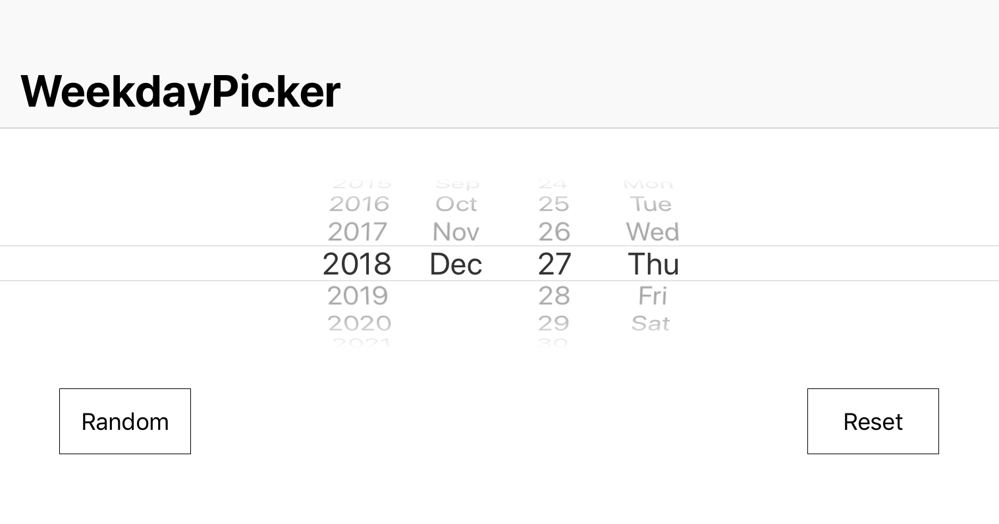

# WeekdayPicker

[](https://img.shields.io/cocoapods/v/SalonWeekdayPicker.svg)
[](https://github.com/Carthage/Carthage)
[](https://github.com/xuechinahb/SalonWeekdayPicker)

WeekdayPicker is a custom UIDatePicker with weekdays.



- [Requirements](#requirements)
- [Installation](#installation)
- [Usage](#usage)
- [License](#license)

## Requirements

- iOS 9.0+
- Xcode 9+
- Swift 4.0+

## Installation

You can choose one of theses options to install WeekdayPicker.

<details>
<summary>📦 CocoaPods — CocoaPods is a library dependencies for Xcode projects.</summary>
[CocoaPods Installation](https://guides.cocoapods.org/using/getting-started.html#getting-started)

To integrate WeekdayPicker into your Xcode project using CocoaPods, specify it in your `Podfile`:

```ruby
source 'https://github.com/CocoaPods/Specs.git'
platform :ios, '9.0'
use_frameworks!

target '<Your Target Name>' do
    pod 'SalonWeekdayPicker', '~> 0.4.0'
end
```

Then, run the following command:

```bash
$ pod install
```
</details>

<details>

<summary>📚 Swift Package Manager — Package manager for the Swift.</summary>

The [Swift Package Manager](https://swift.org/package-manager/) is a tool for automating the distribution of Swift code and is integrated into the `swift` compiler. It is in early development, but WeekdayPicker does support its use on supported platforms.

Once you have your Swift package set up, adding WeekdayPicker as a dependency is as easy as adding it to the `dependencies` value of your `Package.swift`.

```swift
dependencies: [
    .package(url: "https://github.com/xuechinahb/SalonWeekdayPicker.git", from: "1.0.0")
]
```
</details>

### Manually

If you prefer to not use any of the dependency managers, you can integrate WeekdayPicker into your project manually.

### Usage

After adding the framework to your project, import the module.
```swift
import WeekdayPicker
```

Add WeekdayPicker programmatically 🤓
```swift
// Initialization
let myPicker: WeekdayPicker = WeekdayPicker()

// Set min Date
myPicker.setMinDate(Date())

// Add delegation conformance
myPicker.delegated = self

// Apply frame
myPicker.frame = CGRect(origin: CGPoint(x: 0, y: 150),
                        size: CGSize(width: self.view.frame.size.width,
                                     height: 150))        

// The first date to show will be the current date
myPicker.setToDate(Calendar.current.date(byAdding: .day, value: 7, to: Date())!)

// Add picker to current view
self.view.addSubview(myPicker)
```

Implement WeekdayPickerDelegate 🤝
```swift
// MARK: - WeekdayPickerDelegate
extension <#MyViewController#>: WeekdayPickerDelegate {

    func weekdayPickerDateChanged(_ date: Date?) {
        if let changedDate = date {
            print("\(changedDate)")
        }
    }
}
```

### License

WeekdayPicker is released under the MIT license. [See LICENSE](https://github.com/Maximelc/WeekdayPicker/blob/master/LICENSE) for details.
